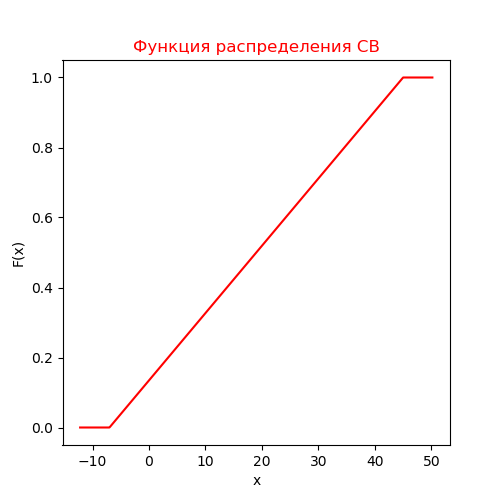

# Отчет по лабораторной работе №1
# Курс: "Моделирование"
# Тема: "Исследование функций и плотностей распределения случайных величин"

## Задание

Реализовать программу для построения графиков функций плотностей для следующих распределений:

* Равномерное распределение
* Экспоненциальное распределение

## Реализация

Для построения графиков функции и плотности распределения, необходимо указать отрезок, на котором должен быть построен график, а также значения параметров распределения.

Для решения данной задачи был реализован интерфейс =_=, определяющий методы () и (), общие для всех классов реализации распределений случайных величин.

Далее приводятся фрагменты кода реализации этих методов для соответствующих распределений.


```python
def exec(self, param1, param2, isUniform=True):
    data0 = []
    data1 = []
    data2 = []

    if isUniform:
        delta = abs(param1 - param2)
        data0 = np.linspace(param1 - 0.1 * delta, param2 + 0.1 * delta, 1000)
        dist = uniform(loc=param1, scale=delta)
        data1 = dist.pdf(data0)
        data2 = dist.cdf(data0)
    else:
        data0 = np.linspace(expon.ppf(0.0001), expon.ppf(0.999999), 1000)
        dist = expon(scale = 1/param1)
        data1 = dist.pdf(data0)
        data2 = dist.cdf(data0)

    self.emitter.emit([data0, data1, data2])
```

Фрагменты коды для построения графиков распределений.

```python
@QtCore.pyqtSlot(list)
def showGraphics(self, data):
    figure = pit.figure(figsize=(5,5))
    pit.title('Плотность распределения СВ', color='green')
    axis = figure.add_subplot(111)
    axis.plot(data[0], data[1], color='green')
    axis.set_xlabel('x')
    axis.set_ylabel('f(x)')
    figure = pit.figure(figsize=(5,5))
    pit.title('Функция распределения СВ', color='red')
    axis = figure.add_subplot(111)
    axis.plot(data[0], data[2], color='red')
    axis.set_xlabel('x')
    axis.set_ylabel('F(x)')
    pit.show()
```


Интерфейс и результаты представлены на рисунках ниже.





## Заключение

Для заданных законов распределений случайных величин были реализованы методы для построения графиков распределений случайных величин по заданным параметрам.
