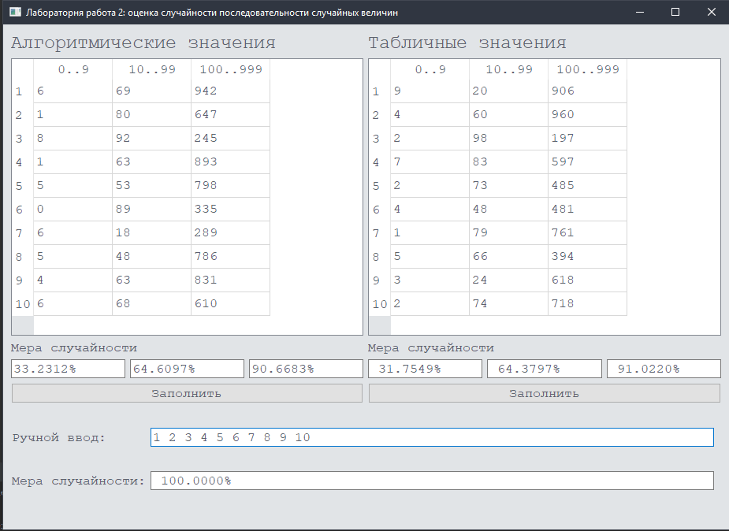

# Отчет по лабораторной работе №2
# Курс: "Моделирование"
# Тема: "Исследование последовательностей случайных чисел"

## Задание

Реализовать критерий оценки случайности последовательности чисел.

Сравнить результаты работы данного критерия на следующих последовательностях целых чисел:

* одноразрядных,
* двухраздряных,
* трехразрядных.

Последовательности получать следующими способами:

* алгоритмическим способом,
* табличным способом,
* путем ввода.

## Реализация

Выбор критерия для оценки последовательности случайных чисел является нетривиальной задачей. Необходимо протестировать последовательность случайных чисел на определенных критерий.

Примеры критериев:
* частотный анализ последовательности,
* проверка пересекающихся частей последовательности,
* проверка случайных отклонений,
* вычисление энтропии последовательности.

При выполнении лабораторной работы был реализовано вычисление энтропии последовательности.

Далее приводится фрагмент кода реализации этого метода.

```python
def CalculateEntropy(sequence):
    count = len(sequence)
    if count <= 1:
        return 0

    hist = dict()
    for el in sequence:
        if el not in hist.keys():
            hist.update({el: 1})
        else:
            hist[el] += 1

    entropy = 0
    for el in hist.keys():
        p = hist[el] / count
        entropy -= p * math.log(p, count)

    return entropy
```

Интерфейс и результаты представлены на рисунке ниже.



## Заключение

Для последовательностей случайных величин, полученных алгоритмическим способом, табличным способом и путем ввода был реализован критерий оценки на основе энтропии.
