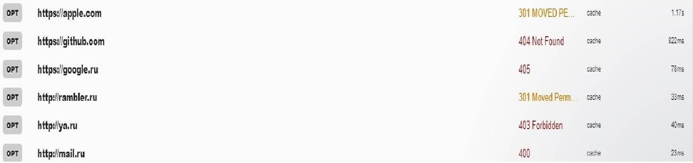

# Отчет по лабораторной работе №1
# Курс: "WEB"
# Тема: "Изучение протокола HTTP"

## Постановка задачи

Цель работы - ознакомиться с применением протокола HTTP в реальных системах.

1. С помощью специального ПО Restlet Client отправить следующие запросы на интернет сервисы:

 * Запрос OPTIONS на http://mail.ru, http://ya.ru, www.rambler.ru, https://www.google.ru, https://github.com/, www.apple.com/;
 * Запрос HEAD на vk.com, www.apple.com, www.msn.com
 * Запрос GET на yandex.ru, google.com и apple.com
 * Запрос POST на yandex.ru, google.com и apple.com

2. Работа с API сайта:

 * Просмотреть структуру запросов https://vk.com/dev/api_requests.

 * Согласно документации (https://vk.com/dev/methods) получить список всех факультетов МГТУ им. Н.Э.Баумана; получить аватарку; получить ответы на вопросы: "какой код ответа присылается от api?", "Что содержит тело ответа?", "В каком формате и какой кодировке содержаться данные?", "Какой веб-сервер отвечает на запросы?", "Какая версия протокола HTTP используется?"; отправить POST запрос, а именно запись пользователю savital и ответить на вопрос "каким образом передаются данные от пользователя к серверу в POST-запросах?"

## Реализация

1. Результаты обработки запросов:

 * Запросы OPTIONS

 

 http-запрос состоит из:
 * Строки запроса
    * Метод
    * URL документа
    * Версия
 * Заголовок
 * Тело запроса

 Метод запроса указывает на тип операции, которая осуществляется в данный момент, то есть что именно веб-сервер должен сделать. URL-документа, чтобы веб сервер знал какой-именно документ нужен.

 OPTIONS: используется для определения возможностей веб-сервера и описания параметров соединения с целевым ресурсом.

 HEAD: Обычно применяется для извлечения метаданных, проверки наличия ресурса и чтобы узнать, не изменился ли он с момента последнего обращения. (GET без тела документа - заголовков и статуса) - например при проверке наличия документа (например поисковыми ботами) Если нет документа из head, то можно получить весь после проверки.

 GET: в теле ответа, как правило содержится документ HTML.

 POST: отправка произвольных данных на сервер (документ или специальный вид (например форма))


 * Запросы OPTIONS

 В настоящий момент нет определенной спецификации для работы с данным заголовком, поэтому каждый ресурс по разному реагирует на запрос с OPTIONS.

 ```
 http://mail.ru
 Server:	nginx/1.10.3
 Date:
 Mon, 03 Dec 2018 17:31:56 GMT-25m 39s
 Content-Type:	text/html
 Transfer-Encoding:	chunked
 Connection:	keep-alive
 X-XSS-Protection:	1; mode=block; report=https://cspreport.mail.ru/xxssprotection
 X-Content-Type-Options:	nosniff```
```
http://ya.ru
 Date:
Mon, 03 Dec 2018 17:32:38 GMT-26m 37s
Content-Type:	text/html; charset=utf-8
ETag:	W/"5c053b38-3077"
Content-Encoding:	gzip
X-Content-Type-Options:	nosniff
Transfer-Encoding:	chunked```
```
http://rambler.ru
Server:	nginx
Date:
Mon, 03 Dec 2018 17:32:57 GMT-27m 50s
Content-Type:	text/html
Content-Length:	162 bytes
Connection:	keep-alive
Keep-Alive:	timeout=50
Location:	https://www.rambler.ru/```
```
https://google.ru
status:	405
allow:
GET, HEAD
date:
Mon, 03 Dec 2018 17:33:34 GMT-27m 25s
content-type:	text/html; charset=UTF-8
server:	gws
content-length:	1 kilobytes
x-xss-protection:	1; mode=block
x-frame-options:	SAMEORIGIN
alt-svc:	quic=":443"; ma=2592000; v="44,43,39,35"```
```
https://github.com
Server:	GitHub.com
Date:
Mon, 03 Dec 2018 17:33:58 GMT-27m 17s
Content-Type:	text/html; charset=utf-8
Transfer-Encoding:	chunked
Status:	404 Not Found
X-Request-Id:	9449f533-727f-48bf-a0db-17d9c7c1eb68
Strict-Transport-Security:	max-age=31536000; includeSubdomains; preload
X-Frame-Options:	deny
X-Content-Type-Options:	nosniff
X-XSS-Protection:	1; mode=block
Referrer-Policy:	origin-when-cross-origin, strict-origin-when-cross-origin
Expect-CT:	max-age=2592000, report-uri="https://api.github.com/_private/browser/errors"
Content-Security-Policy:	default-src 'none'; base-uri 'self'; block-all-mixed-content; connect-src 'self' uploads.github.com status.github.com collector.githubapp.com api.github.com www.google-analytics.com github-cloud.s3.amazonaws.com github-production-repository-file-5c1aeb.s3.amazonaws.com github-production-upload-manifest-file-7fdce7.s3.amazonaws.com github-production-user-asset-6210df.s3.amazonaws.com; font-src assets-cdn.github.com; form-action 'self' github.com gist.github.com; frame-ancestors 'none'; frame-src render.githubusercontent.com; img-src 'self' data: assets-cdn.github.com media.githubusercontent.com camo.githubusercontent.com identicons.github.com collector.githubapp.com avatars0.githubusercontent.com avatars1.githubusercontent.com avatars2.githubusercontent.com avatars3.githubusercontent.com github-cloud.s3.amazonaws.com; manifest-src 'self'; media-src 'none'; script-src assets-cdn.github.com; style-src 'unsafe-inline' assets-cdn.github.com
Content-Encoding:	gzip
X-GitHub-Request-Id:	E5EB:1B15:209AB35:3BC5522:5C056906```
```
https://apple.com
Server:	Apache
Date:
Mon, 03 Dec 2018 17:34:18 GMT-27m 17s
Location:	https://www.apple.com/
Content-type:	text/html
Connection:	close```

 

 * Запросы HEAD

 ```
 https://www.apple.com/
 Server:	Apache
Date:
Mon, 03 Dec 2018 18:15:56 GMT-14s
Location:	https://www.apple.com/
Content-type:	text/html
Connection:	close```

 ```
 https://www.msn.com/
 Content-Length:	143 bytes
 Content-Type:	text/html; charset=UTF-8
 Location:	https://www.msn.com/
 Server:	Microsoft-IIS/8.5
 X-Powered-By:	ASP.NET
 Date:
 Mon, 03 Dec 2018 18:16:08 GMT-26s```

 ```
 https://www.msn.com/ru-ru/
status:	200
cache-control:
no-cache, no-store, no-transform
pragma:	no-cache
content-length:	0 byte
content-type:	text/html; charset=utf-8
content-encoding:	gzip
expires:	-1
vary:	User-Agent
access-control-allow-origin:	*
x-aspnetmvc-version:	5.2
x-appversion:	20181127_13106485
x-activity-id:	ee2b20f0-92c6-478a-b50d-5b70e3f1925d
x-az:	{did:b24a0ea2b3ba45a59fc1d4d299c5ebc1, rid: 40, sn: neurope-prod-hp, dt: 2018-12-03T06:07:42.7770973Z, bt: 2018-11-28T00:44:45.7655816Z}
strict-transport-security:	max-age=1209600
content-security-policy:	default-src 'self' data: 'unsafe-inline' 'unsafe-eval' https: blob:; media-src 'self' https: blob:; worker-src 'self' https: blob:; block-all-mixed-content; connect-src 'self' data: 'unsafe-inline' 'unsafe-eval' https: blob: https://*.trouter.io:443 https://*.trouter.skype.com:443 wss://*.trouter.io:443 wss://*.trouter.skype.com:443;
x-ua-compatible:	IE=Edge;chrome=1
x-content-type-options:	nosniff
x-frame-options:	SAMEORIGIN
x-powered-by:	ASP.NET
access-control-allow-methods:
HEAD, GET, OPTIONS
x-xss-protection:	1
x-msedge-ref:	Ref A: EE2B20F092C6478AB50D5B70E3F1925D Ref B: STOEDGE0416 Ref C: 2018-12-03T18:57:30Z
date:
Mon, 03 Dec 2018 18:57:29 GMT-6m 49s```

* Запросы GET

 

 ```
 Date:
Mon, 03 Dec 2018 19:17:04 GMT-8m 57s
Content-Type:	text/html; charset=UTF-8
Cache-Control:
no-cache, no-store, max-age=0, must-revalidate
Expires:
Mon, 03 Dec 2018 19:17:05 GMT-8m 56s
Last-Modified:
Mon, 03 Dec 2018 19:17:05 GMT-8m 56s
Content-Security-Policy:	connect-src 'self' wss://webasr.yandex.net https://mc.webvisor.com https://mc.webvisor.org wss://push.yandex.ru wss://portal-xiva.yandex.net https://yastatic.net https://home.yastatic.net https://yandex.ru https://*.yandex.ru static.yandex.sx brotli.yastatic.net et.yastatic.net *.serving-sys.com portal-xiva.yandex.net yastatic.net home.yastatic.net yandex.ru *.yandex.ru *.yandex.net yandex.st; default-src 'self' blob: wss://portal-xiva.yandex.net yastatic.net portal-xiva.yandex.net; font-src 'self' https://yastatic.net static.yandex.sx brotli.yastatic.net et.yastatic.net zen.yandex.ru yabro1.zen-test.yandex.ru main.zdevx.yandex.ru yastatic.net; frame-src 'self' yabrowser: data: https://www.youtube.com https://player.video.yandex.net https://ya.ru https://ok.ru https://yastatic.net https://yandex.ru https://*.yandex.ru https://downloader.yandex.net wfarm.yandex.net secure-ds.serving-sys.com yandexadexchange.net *.yandexadexchange.net yastatic.net yandex.ru *.yandex.ru awaps.yandex.net *.cdn.yandex.net; img-src 'self' data: https://yastatic.net https://home.yastatic.net https://*.yandex.ru https://*.yandex.net https://*.tns-counter.ru *.yastatic.net gdeua.hit.gemius.pl pa.tns-ua.com mc.yandex.com mc.webvisor.com mc.webvisor.org static.yandex.sx brotli.yastatic.net et.yastatic.net *.moatads.com avatars.mds.yandex.net yastatic.net home.yastatic.net yandex.ru *.yandex.ru *.yandex.net *.tns-counter.ru yandex.st; media-src 'self' blob: data: *.storage.yandex.net *.yandex.net yastatic.net kiks.yandex.ru strm.yandex.ru; object-src 'self' *.yandex.net music.yandex.ru strm.yandex.ru yastatic.net kiks.yandex.ru awaps.yandex.net storage.mds.yandex.net; report-uri https://csp.yandex.net/csp?from=yaru.ru&showid=1543864624.84792.172833.4324&h=sas2-0913-sas-portal-morda-yaru-s-555-27240&csp=old&date=20181203&yandexuid=6857719731530607989; script-src 'self' 'unsafe-inline' 'unsafe-eval' blob: https://suburban-widget.rasp.yandex.ru https://suburban-widget.rasp.yandex.net https://music.yandex.ru https://mc.yandex.fr https://mc.webvisor.com https://yandex.fr https://mc.webvisor.org https://yastatic.net https://home.yastatic.net https://mc.yandex.ru https://pass.yandex.ru an.yandex.ru api-maps.yandex.ru static.yandex.sx webasr.yandex.net brotli.yastatic.net et.yastatic.net z.moatads.com bs.serving-sys.com secure-ds.serving-sys.com zen.yandex.ru yabro1.zen-test.yandex.ru main.zdevx.yandex.ru yastatic.net home.yastatic.net yandex.ru www.yandex.ru mc.yandex.ru suggest.yandex.ru clck.yandex.ru awaps.yandex.net; style-src 'self' 'unsafe-inline' https://yastatic.net https://home.yastatic.net static.yandex.sx brotli.yastatic.net et.yastatic.net zen.yandex.ru yabro1.zen-test.yandex.ru main.zdevx.yandex.ru yastatic.net home.yastatic.net;
P3P:	policyref="/w3c/p3p.xml", CP="NON DSP ADM DEV PSD IVDo OUR IND STP PHY PRE NAV UNI"
Set-Cookie:
_ym_d=1 B, session
.ya.ru/
X-Frame-Options:	DENY
Content-Encoding:	gzip
X-Content-Type-Options:	nosniff
Transfer-Encoding:	chunked
```

 ```
status:	200
date:
Mon, 03 Dec 2018 19:17:41 GMT-8m 46s
expires:	-1
cache-control:
private, max-age=0
content-type:	text/html; charset=UTF-8
strict-transport-security:	max-age=31536000
content-encoding:	br
server:	gws
x-xss-protection:	1; mode=block
x-frame-options:	SAMEORIGIN
set-cookie:
1P_JAR=14 B, session
.google.ru/
alt-svc:	quic=":443"; ma=2592000; v="44,43,39,35"
```

 ```
status:	200
cache-control:
no-cache, no-store, no-transform
pragma:	no-cache
content-type:	text/html; charset=utf-8
content-encoding:	gzip
expires:	-1
vary:	User-Agent
access-control-allow-origin:	*
x-aspnetmvc-version:	5.2
x-appversion:	20181127_13106485
x-activity-id:	73fbc5e0-0774-4a0c-a983-f82231f7e4a1
x-az:	{did:b24a0ea2b3ba45a59fc1d4d299c5ebc1, rid: 40, sn: neurope-prod-hp, dt: 2018-12-03T06:07:42.7770973Z, bt: 2018-11-28T00:44:45.7655816Z}
strict-transport-security:	max-age=1209600
content-security-policy:	default-src 'self' data: 'unsafe-inline' 'unsafe-eval' https: blob:; media-src 'self' https: blob:; worker-src 'self' https: blob:; block-all-mixed-content; connect-src 'self' data: 'unsafe-inline' 'unsafe-eval' https: blob: https://*.trouter.io:443 https://*.trouter.skype.com:443 wss://*.trouter.io:443 wss://*.trouter.skype.com:443;
x-ua-compatible:	IE=Edge;chrome=1
x-content-type-options:	nosniff
x-frame-options:	SAMEORIGIN
x-powered-by:	ASP.NET
access-control-allow-methods:
HEAD, GET, OPTIONS
x-xss-protection:	1
x-msedge-ref:	Ref A: 73FBC5E007744A0CA983F82231F7E4A1 Ref B: STOEDGE0515 Ref C: 2018-12-03T19:18:18Z
date:
Mon, 03 Dec 2018 19:18:18 GMT-8m 24s
```

 

* Запросы POST
```
 Date:
 Mon, 03 Dec 2018 19:07:15 GMT-16m 18s
 Content-Type:	text/html; charset=utf-8
 ETag:	W/"5c053b38-3077"
 Content-Encoding:	gzip
 X-Content-Type-Options:	nosniff
 Transfer-Encoding:	chunked
 ```

 ```
 status:	405
allow:
GET, HEAD
date:
Mon, 03 Dec 2018 19:07:31 GMT-16m 18s
content-type:	text/html; charset=UTF-8
server:	gws
content-length:	1 kilobytes
x-xss-protection:	1; mode=block
x-frame-options:	SAMEORIGIN
alt-svc:	quic=":443"; ma=2592000; v="44,43,39,35"
```

 ```
status:	200
cache-control:
no-cache, no-store, no-transform
pragma:	no-cache
content-type:	text/html; charset=utf-8
content-encoding:	gzip
expires:	-1
vary:	User-Agent
access-control-allow-origin:	*
x-aspnetmvc-version:	5.2
x-appversion:	20181127_13106485
x-activity-id:	1e9b6143-d967-4464-bcd8-4d7de24e1e98
x-az:	{did:b24a0ea2b3ba45a59fc1d4d299c5ebc1, rid: 19, sn: neurope-prod-hp, dt: 2018-11-16T19:08:23.8731544Z, bt: 2018-11-28T00:44:45.7655816Z}
strict-transport-security:	max-age=1209600
content-security-policy:	default-src 'self' data: 'unsafe-inline' 'unsafe-eval' https: blob:; media-src 'self' https: blob:; worker-src 'self' https: blob:; block-all-mixed-content; connect-src 'self' data: 'unsafe-inline' 'unsafe-eval' https: blob: https://*.trouter.io:443 https://*.trouter.skype.com:443 wss://*.trouter.io:443 wss://*.trouter.skype.com:443;
x-ua-compatible:	IE=Edge;chrome=1
x-content-type-options:	nosniff
x-frame-options:	SAMEORIGIN
x-powered-by:	ASP.NET
access-control-allow-methods:
HEAD, GET, OPTIONS
x-xss-protection:	1
x-msedge-ref:	Ref A: 1E9B6143D9674464BCD84D7DE24E1E98 Ref B: STOEDGE0406 Ref C: 2018-12-03T19:08:49Z
date:
Mon, 03 Dec 2018 19:08:48 GMT-15m 18s
```

2. VK api:
 * Структура запросов
 ```txt
 xxx```
 * По документации
    * Список факультетов
    [faculties](faculties.jpg)
    * Аватарка
    [avatar](avatar.jpg)
    * Ответы на вопросы:
    ```txt
    Код ответа от api
    Тело ответа
    Формат и кодировка
    Веб сервер () отвечает запросы
    Версия () HTTP протокола используется```

    * Отправлен POST запрос пользователю savital
    [savitalPost](savitalPost.jpg)
    Данные от пользователя к серверу в POST запросах передаются следующим образом
    ```txt
    HelloWorld
    ```
