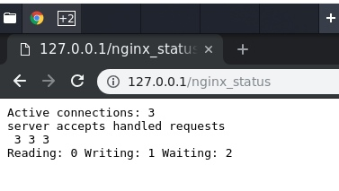

# WEB
# Лабораторная работа № 1
## Знакомство с nginx

### Часто используемые команды

```bash
sudo nginx

sudo nginx -t

sudo ngins -s stop

sudo /etc/init.d/nginx restart

uwsgi --socket labs.sock --wsgi-file wsgi.py --chmod-socket=666

uwsgi --http :8000 --wsgi-file wsgi.py

sudo nginx -V 2>&1 | grep -o with-http_stub_status_module

```

### Задание

Цель: Сконфигурировать nginx сервер


1.	Замерить скорость отдачи контента на сервере из лабораторной работы №1. Добавьте логирование приходящих запросов.

2.	Сконфигурируйте nginx сервер таким образом, чтобы запросы проходили через nginx и перенаправлялись на сервер из лабораторной работы №1.

3.	Использовать nginx отдачи статического контента. 

4.	Настроить кеширование и gzip сжатие файлов. 

5.	Запустить 2 инстанса сервера из лабораторной работы №1, настроить перенаправление таким образом, чтобы на серверы приходили запросы в соотношении 3:1. 

6.	 Написать дополнительно два мини-сервера. Каждый из них должен обрабатывать два GET-запроса.
a.	по / отдавать страницу с надписью “Добро пожаловать на сервис #1/#2” и ссылкой, ведущей на /temp
b.	по /temp  возвращать произвольный контент

7.	Настроить отдачу страницы о состоянии сервера

Дополнительные задания:

1.	Настроить https порт на сервере nginx. Использовать самоподписанный сертификат.

2.	Добавить ServerPush картинки для страницы index.html.

3.	Для повышения уровня безопасности необходимо скрывать внутреннюю реализацию вашего сервера. Скрыть все заголовки Server из header ответа.


### Реализация

#### Логирование

Необходимо добавить следующий код в setting.py.

Как результат в корне проекта будут созданы два файла логов, соответствующие строкам filename.

```bash
LOGGING = {
    'version': 1,
    'disable_existing_loggers': True,
    'formatters': {
        'longout': {
            'format': '[%(asctime)s][%(levelname)s:%(name)s:%(lineno)d] %(message)s '
                      '\n_________________________________________________________\n'
        },
        'simple': {
            'format': '[%(asctime)s][%(levelname)s:%(name)s:%(lineno)d] %(message)s '
        },
        'colored': {
            '()': DjangoColorsFormatter,
            'format': '[%(asctime)s] - %(levelname)s - %(message)s',
            'datefmt': '%d/%b/%Y %H:%M:%S',
        }
    },
    'handlers': {
        'file_db': {
            'level': 'DEBUG',
            'class': 'logging.FileHandler',
            'filename': 'labs-db.log',
            'formatter': 'longout',
        },
        'file_requests': {
            'level': 'DEBUG',
            'class': 'logging.FileHandler',
            'filename': 'labs-requests.log',
            'formatter': 'simple',
        },
        'console': {
            'level': 'DEBUG',
            'class': 'logging.StreamHandler',
            'formatter': 'colored',
        },
    },
    'loggers': {
        'django.db': {
            'handlers': ['file_db', 'console'],
            'level': 'DEBUG',
            'propagate': False,
        },
        'django': {
            'handlers': ['file_requests', 'console'],
            'level': 'DEBUG',
            'propagate': False,
        },
    }
}
```

#### Сервер из лабораторной работы 1

##### Значения времени для страницы, картинки и запросов

|Контент|Время отдачи |
|---|---|
|Cтраница| 33 ms |
|Картинка| 61 ms |
|API (GET)| 111 ms |
|API (POST)| 40 ms |
|API (DELETE)| 35 ms|
|API (PUT)| 42 ms |
|API (OPTION)| 51 ms |
|API (HEAD)| 13 ms |


##### Apache Benchmark результат

```bash
(venv) savital@savital-VM:~/repos/BMSTU/WEB/labs$ ab -c 10 -n 100 http://localhost:8000/
This is ApacheBench, Version 2.3 <$Revision: 1807734 $>
Copyright 1996 Adam Twiss, Zeus Technology Ltd, http://www.zeustech.net/
Licensed to The Apache Software Foundation, http://www.apache.org/

Benchmarking localhost (be patient).....done


Server Software:        WSGIServer/0.2
Server Hostname:        localhost
Server Port:            8000

Document Path:          /
Document Length:        3216 bytes

Concurrency Level:      10
Time taken for tests:   0.704 seconds
Complete requests:      100
Failed requests:        0
Total transferred:      356900 bytes
HTML transferred:       321600 bytes
Requests per second:    141.98 [#/sec] (mean)
Time per request:       70.434 [ms] (mean)
Time per request:       7.043 [ms] (mean, across all concurrent requests)
Transfer rate:          494.84 [Kbytes/sec] received

Connection Times (ms)
              min  mean[+/-sd] median   max
Connect:        0    0   0.1      0       0
Processing:     6   68  19.0     69     115
Waiting:        5   61  16.4     63     103
Total:          6   68  19.0     69     115

Percentage of the requests served within a certain time (ms)
  50%     69
  66%     76
  75%     82
  80%     83
  90%     91
  95%    102
  98%    109
  99%    115
 100%    115 (longest request)

```


#### После добавления nginx + uwsgi

##### Значения времени для страницы, картинки и запросов

|Контент|Время отдачи |
|---|---|
|Cтраница| 31 ms |
|Картинка| 21 ms |
|API (GET)| 89 ms |
|API (POST)| 33 ms |
|API (DELETE)| 21 ms|
|API (PUT)| 36 ms |
|API (OPTION)| 42 ms |
|API (HEAD)| 11 ms |

##### Apache Benchmark результат

```bash
(venv) savital@savital-VM:~/repos/BMSTU/WEB/labs$ ab -c 10 -n 100 http://localhost:8000/
This is ApacheBench, Version 2.3 <$Revision: 1807734 $>
Copyright 1996 Adam Twiss, Zeus Technology Ltd, http://www.zeustech.net/
Licensed to The Apache Software Foundation, http://www.apache.org/

Benchmarking localhost (be patient).....done


Server Software:        nginx/1.14.0
Server Hostname:        localhost
Server Port:            8000

Document Path:          /
Document Length:        3216 bytes

Concurrency Level:      10
Time taken for tests:   0.348 seconds
Complete requests:      100
Failed requests:        0
Total transferred:      358000 bytes
HTML transferred:       321600 bytes
Requests per second:    287.51 [#/sec] (mean)
Time per request:       34.781 [ms] (mean)
Time per request:       3.478 [ms] (mean, across all concurrent requests)
Transfer rate:          1005.16 [Kbytes/sec] received

Connection Times (ms)
              min  mean[+/-sd] median   max
Connect:        0    0   0.2      0       1
Processing:     4   33   5.4     34      38
Waiting:        4   33   5.4     34      38
Total:          5   33   5.2     34      38

Percentage of the requests served within a certain time (ms)
  50%     34
  66%     34
  75%     35
  80%     35
  90%     36
  95%     37
  98%     38
  99%     38
 100%     38 (longest request)

```


Nginx должен быть сконфигурирован с модулем http_stub_status_module
```bash
nginx -V 2> & 1 | grep -o с-http_stub_status_module
```

В конфгурацию nginx вставить:
```bash
 location /nginx_status {
          stub_status on;
          access_log   off;
          allow 127.0.0.1;
          deny all;
        }
```



### Доп задания


Командой создано в корне nginx 2 файла localhost.key|localhost.crt

```bash
openssl req -x509 -out localhost.crt -keyout localhost.key \
  -newkey rsa:2048 -nodes -sha256 \
  -subj '/CN=localhost' -extensions EXT -config <( \
   printf "[dn]\nCN=localhost\n[req]\ndistinguished_name = dn\n[EXT]\nsubjectAltName=DNS:localhost\nkeyUsage=digitalSignature\nextendedKeyUsage=serverAuth")
```

В labs_nginx.conf

```bash
    ssl_certificate     localhost.crt;
    ssl_certificate_key localhost.key;
    ssl_protocols       TLSv1.2;
```


```bash
    http2_push_preload on;

    http2_push /static/css/style.css;
    http2_push /static/images/df.jpg;
    http2_push /static/images/Lupis.jpg;
```

Время увеличилось.


```bash
    proxy_hide_header "Content-Type";
    proxy_hide_header "Date";
    proxy_hide_header "Set-Cookie";
    proxy_hide_header "Server";
```

