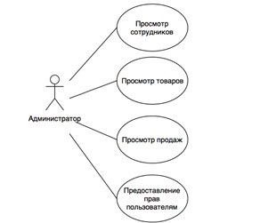
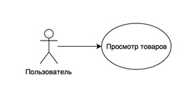
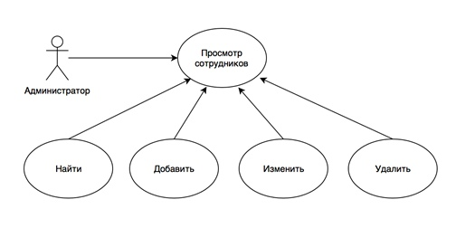
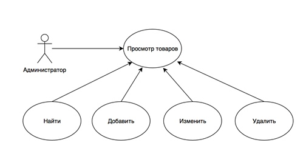
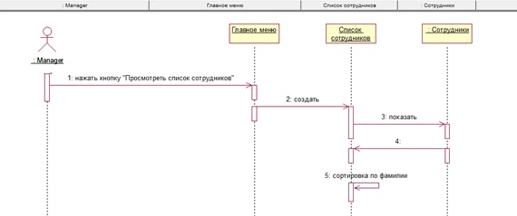
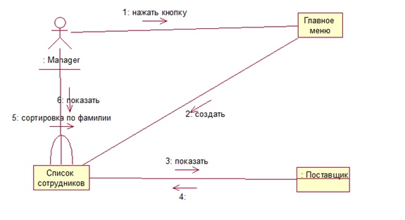
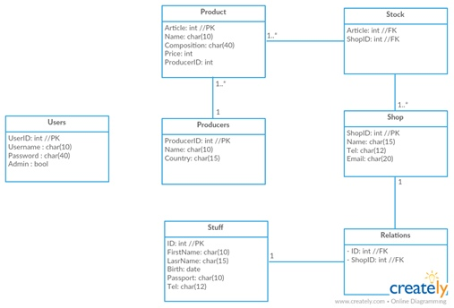
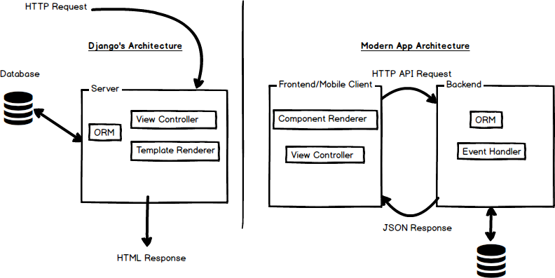

# Отчет по лабораторной работе №3
# Курс: "WEB"
# Тема: "Разработка архитектуры web приложения"

## Постановка задачи

Цель работы - необходимо спланировать архитектуру разрабатываемого приложения.

1.	Название проекта
2.	Краткое описание проблемной области и актуальности
 * 	Какая проблема
 *	Как решаем
3.	Описание ролей пользователя
 * 	Use-Case диаграмма (основные кейсы)
 *	Назначение ролей пользователя
4.	Сущности предметной области
 * 	ER-диаграмма сущностей
5.	Прототип интерфейса (sketch) со всеми страницами. (Можно использовать MockFlow  или любой другой специализированный инструмент, paint/photoshop, салфетку и карандаш). Краткое описание основных функциональных действий.
6.	Архитектура приложения
 *	Выбор архитектуры (MPA-SPA)
 *	Диаграмма взаимодействия Backend-Frontend
 *	Описание протокола взаимодействия Backend-Frontend / Rest API - при наличии 
 * 	Структура модулей/классов для Backend и Frontend
7.	Техническое решение 
 * Выбор Backend- и Frontend-стеков

## Реализация
 
### Название проекта

Разработать интернет-магазин книг

### Краткое описание проблемной области и актуальности 

Интернет-магазины востребованы на рынке. В связи с популярностью интернета каждый магазин создает собственные сайты, с возможностью предоставить информацию о доступных для покупки товаров, сделать заказ, формами обратной связи и так далее.

Для решения этой проблемы планируется разработать сайт интернет-магазина книг.

Потребуются следующие таблицы базы данных: Производители, Продукты, Склады, Магазины, Сотрудники, Пользователи 

### Описание ролей пользователя

#### USE-case

#### Преценденты

### Сущности предметной области 

#### ER-диаграмма

### Прототип интерфейса со всеми страницами

### Архитектура приложения

В качестве архитектуры используется MPA

Технология конструирования сложного программного продукта предполагает, что он будет разбит на модули и помодульно создан.

Структурно программу можно представить следующей схемой:

Рис4 Схема функционирования

В основе программы лежит схема разделения данных приложения, пользовательского интерфейса и управляющей логики на три отдельных компонента MVC:
* Model - предоставляет данные и методы работы с ними, то есть запросы в базу данных, не зависит от представления и не знает какие данные необходимо визуализировать, не зависит от контролеера, то есть не имеет точек взаимодействия с пользователем. Фактически просто предоставляет доступ к данным и управлению ими.
* View - отвечает за получение необходимых данных модели и отправляет их пользователю. Не обрабатывает введенные данные. Может влиять на состояние модели.
* Controller - обеспечивает связи между пользователем и системой. Контролирует и направляет данные от пользоватлея к системе и наоборот. Использует модель и представление для реализации необходимых действий.

База данных - sqlite

Используется интерфейс DjangoAdmin для администрирования базы данных.

 

### Техническое решение

В качестве технического решения используются

* Фронтенд стек: html, css, js

* Бэкенд стек: python, django